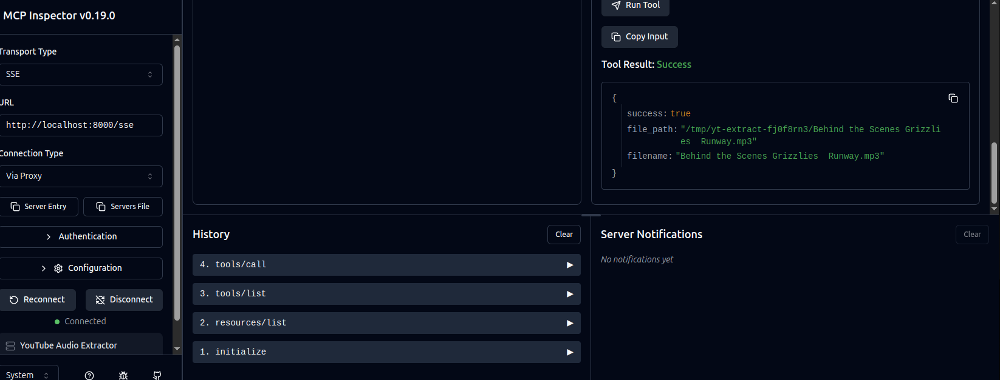

## InnoFrance YouTube Audio Extractor

Extract YouTube audio to **MP3** or **WAV** through a web API, CLI, or MCP server.


### Key Features

- FastAPI service with a simple web UI and JSON/form endpoints
- CLI for local usage and automation
- MCP server for LLM workflows (stdio or SSE transport)
- Reusable core logic in `app.core.AudioExtractor`

### Requirements

- Python 3.10+
- `ffmpeg` installed and available on PATH
- Network access to YouTube

Install ffmpeg on Ubuntu/Debian:

```bash
sudo apt update
sudo apt install -y ffmpeg
```

### Setup (Conda Recommended)

```bash
pip install -r requirements.txt
```

### Run the Web Service

```bash
uvicorn app.main:app --host 0.0.0.0 --port 8000 --reload
```

Open `http://localhost:8000`.

### API Usage (curl)

Health check:

```bash
curl -s http://localhost:8000/api/health
```

Download MP3 via **POST JSON**:

```bash
curl -L -X POST http://localhost:8000/api/extract \
  -H 'Content-Type: application/json' \
  -H 'X-Client-Id: my-cli' \
  -d '{"url":"https://www.youtube.com/watch?v=WRvWLWfv4Ts"}' \
  -OJ
```

Download MP3 via **GET**:

```bash
curl -L -G http://localhost:8000/api/extract \
  --data-urlencode "url=https://www.youtube.com/watch?v=WRvWLWfv4Ts" \
  -OJ
```

Download MP3 via **POST form**:

```bash
curl -L -X POST http://localhost:8000/api/extract/form \
  -H 'Content-Type: application/x-www-form-urlencoded' \
  --data-urlencode "url=https://www.youtube.com/watch?v=WRvWLWfv4Ts" \
  -OJ
```

### CLI Usage

```bash
# Basic usage - extract to current directory
python -m app.cli "https://www.youtube.com/watch?v=WRvWLWfv4Ts"

# Specify output format (mp3 or wav)
python -m app.cli "https://www.youtube.com/watch?v=WRvWLWfv4Ts" --format wav

# Specify output file path
python -m app.cli "https://www.youtube.com/watch?v=WRvWLWfv4Ts" --output audio.mp3

# Specify output directory
python -m app.cli "https://www.youtube.com/watch?v=WRvWLWfv4Ts" --output-dir /path/to/output
```

CLI options:
- `--format`, `-f`: Audio format (mp3 or wav), default is mp3
- `--output`, `-o`: Output file path
- `--output-dir`, `-d`: Output directory (used when --output is not specified)

### MCP Server (stdio)

Run the MCP server over stdio:

```bash
python -m app.mcp_server
```

Add to your MCP client configuration:

```json
{
  "mcpServers": {
    "youtube-audio-extractor": {
      "command": "python",
      "args": ["-m", "app.mcp_server"]
    }
  }
}
```

### MCP Server (SSE)

Run the MCP server over SSE for remote deployment:

```bash
python -m app.mcp_server --transport sse --host 0.0.0.0 --port 8000
```

Use your MCP client to connect to the server host and port. The exact SSE endpoints are managed by FastMCP.



### Logging / Audit Trail

The service logs caller identity, request details, and success/failure status.

- **Request correlation**: every response includes `X-Request-Id` (you can also send your own `X-Request-Id`)
- **Caller identity**: send `X-Client-Id: my-service` (preferred) or `X-Api-Key: ...` (partially logged)
- **Log destination**: stdout + rotating file at `./logs/app.log` (configurable)

Environment variables:

- **LOG_LEVEL**: `DEBUG|INFO|WARNING|ERROR` (default `INFO`)
- **LOG_FORMAT**: `json|text` (default `json`)
- **LOG_FILE**: path (default `./logs/app.log`)
- **TRUST_PROXY_HEADERS**: set to `1` when running behind a proxy

### Testing

Unit tests:

```bash
pytest tests/
```

Integration test (real YouTube download):

```bash
RUN_YT_INTEGRATION=1 \
YOUTUBE_TEST_URL="https://www.youtube.com/watch?v=WRvWLWfv4Ts" \
pytest tests/test_integration.py -v
```

### Notes

- This app uses `yt-dlp` to download audio and `ffmpeg` to convert formats.
- Some videos may be unavailable due to region/age restrictions or DRM.

